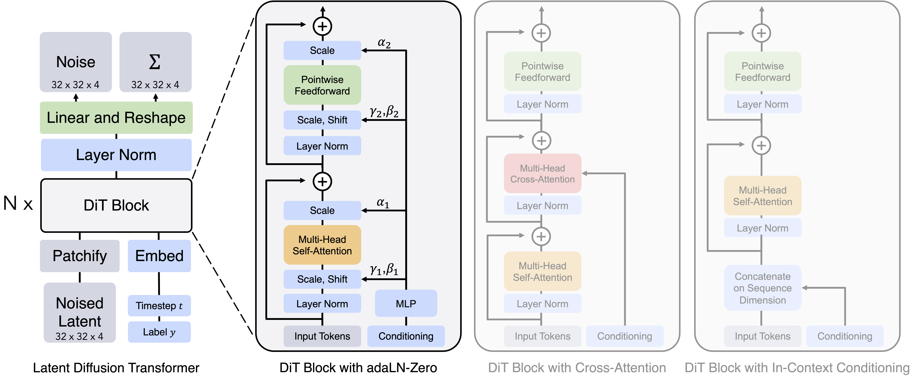
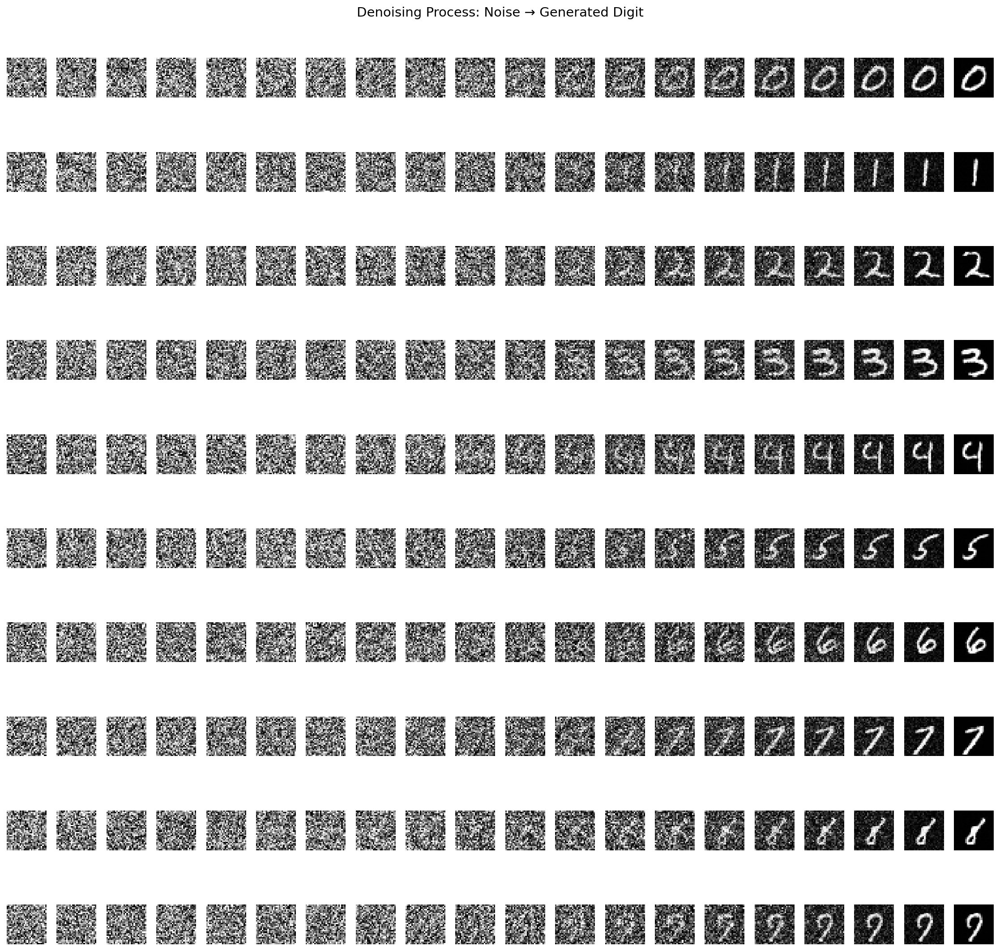
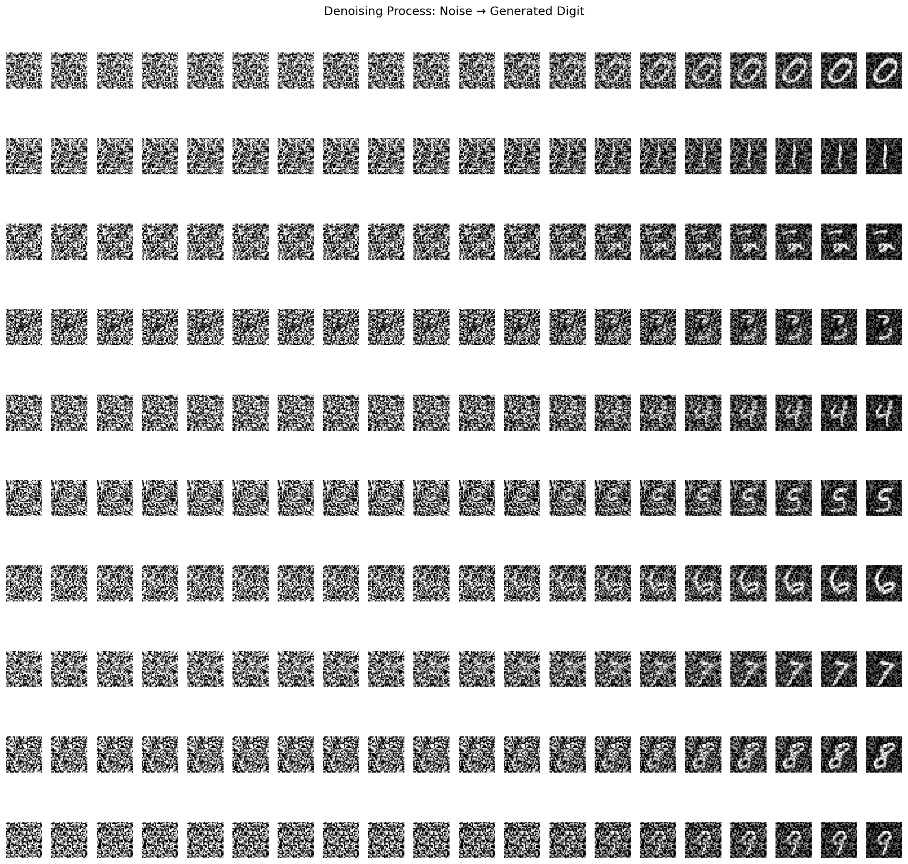
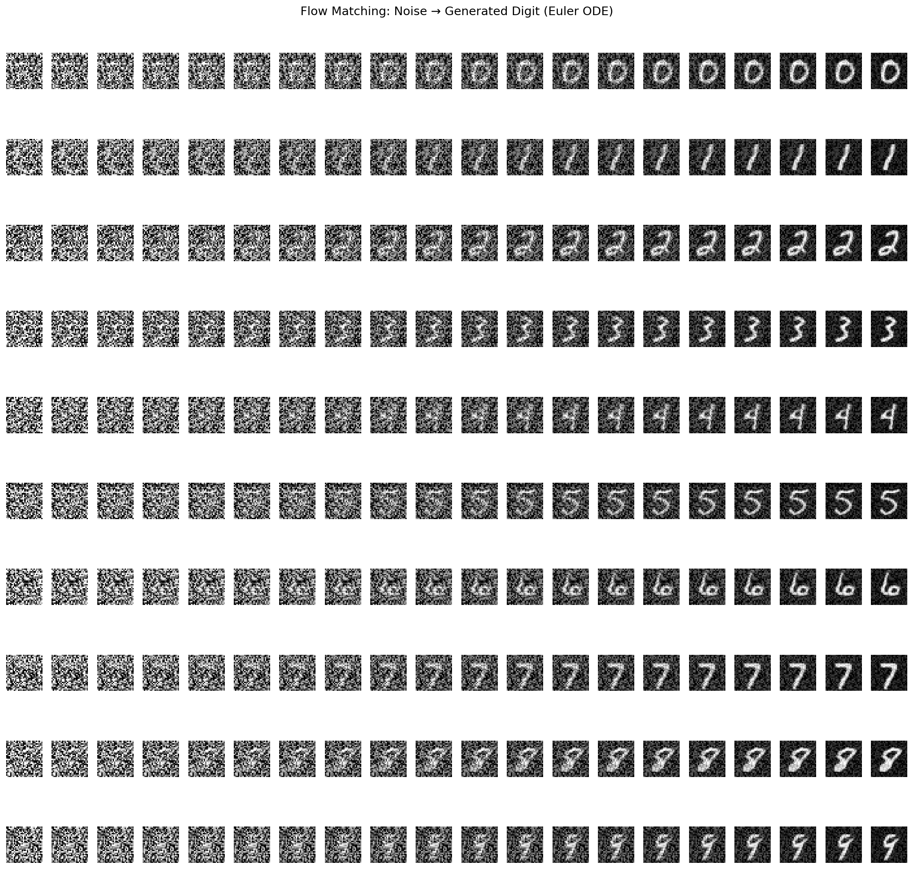
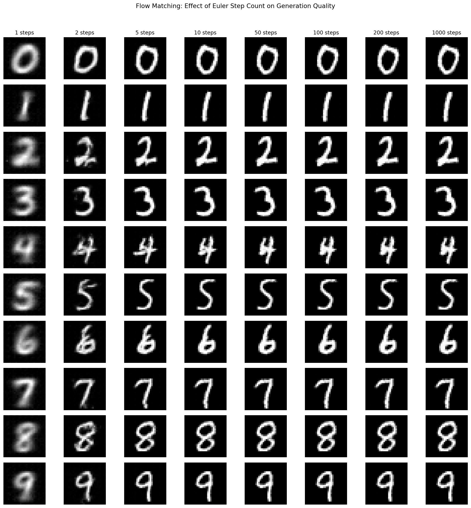

# DiT-101

A minimal, from-scratch implementation of [Diffusion Transformers (DiT)](https://www.wpeebles.com/DiT) for conditional image generation on the MNIST dataset. This project demonstrates how to combine Vision Transformers with diffusion to generate class-conditional handwritten digits, with three sampling methods: DDPM, DDIM, and Flow Matching.

## Model Architecture

The model patchifies 28x28 images into a sequence of 4x4 patches, processes them through transformer blocks with **Adaptive Layer Normalization (AdaLN-Zero)** conditioning, and reconstructs the full image.



| Parameter | Value |
|---|---|
| Image Size | 28 x 28 |
| Patch Size | 4 x 4 (49 patches) |
| Embedding Dim | 64 |
| DiT Blocks | 3 |
| Attention Heads | 4 |
| Diffusion Steps | 1000 |
| Classes | 10 (digits 0-9) |

## Project Structure

```
├── dit.py            # Full DiT model (patchify → transformer blocks → unpatchify)
├── dit_block.py      # Transformer block with AdaLN-Zero conditioning
├── time_emb.py       # Sinusoidal timestep embedding
├── diffusion.py      # DDPM forward process (noise scheduling)
├── flow_matching.py  # Flow matching forward process (linear interpolation)
├── dataset.py        # MNIST dataset wrapper
├── train.py          # Training loop (DDPM)
├── train_fm.py       # Training loop (Flow Matching)
├── inference.py      # Image generation (DDPM / DDIM samplers)
├── inference_fm.py   # Image generation (Flow Matching ODE sampler)
├── config.py         # Global config (T=1000 timesteps)
├── model.pth         # Pretrained DDPM checkpoint
└── model_fm.pth      # Pretrained Flow Matching checkpoint
```

## How It Works

**Training (DDPM)** — Sample a clean image, add noise at a random timestep via the forward diffusion process, and train the model to predict the added noise (L1 loss).

**Training (Flow Matching)** — Sample a clean image, linearly interpolate toward noise at a random t ∈ [0, 1], and train the model to predict the velocity field (MSE loss).

**Inference** — Start from pure Gaussian noise and iteratively denoise, conditioned on a target digit class. Three samplers are available (see below).

## Samplers: DDPM vs DDIM vs Flow Matching

| | DDPM | DDIM | Flow Matching |
|---|---|---|---|
| Steps | 1000 (all required) | Configurable (e.g. 50) | Configurable (e.g. 50) |
| Stochastic? | Yes | No (deterministic) | No (deterministic) |
| Requires retraining? | — | No (same model) | Yes (different objective) |
| Forward process | Noise schedule (betas, alphas) | Same as DDPM | Linear interpolation |
| Model predicts | Noise ε | Noise ε | Velocity v = ε − x₀ |
| Sampler | Reverse Markov chain | Non-Markovian update | Euler ODE solver |

## Results

Each row shows one digit class (0-9) progressively generated from random noise (left) to a clean image (right).

### DDPM (1000 steps)



### DDIM (50 steps)



### Flow Matching (50 steps)



### Flow Matching — Step Count Comparison

Same initial noise sampled with 1, 2, 5, 10, 50, 100, 200, and 1000 Euler steps. Each row is a digit class (0-9), each column is a step count:



## Getting Started

### Requirements

- Python 3
- PyTorch
- torchvision
- matplotlib
- wandb

### Training

```bash
python train.py
```

Trains for 500 epochs with batch size 300. Checkpoints are saved to `model.pth` every 1000 iterations. A GPU is recommended.

### Inference (DDPM / DDIM)

```bash
python inference.py
```

Set `SAMPLER = "ddpm"` or `SAMPLER = "ddim"` at the top of `inference.py` to choose between samplers. Generates one image per digit class (0-9) and saves the progression to `inference_ddpm.png` or `inference_ddim.png`.

### Training (Flow Matching)

```bash
python train_fm.py
```

Trains the same DiT architecture with the flow matching objective. Checkpoint saved to `model_fm.pth`.

### Inference (Flow Matching)

```bash
python inference_fm.py
```

Generates images using the Euler ODE sampler and saves to `inference_fm.png`.

## Interactive Notebook
You can also try the interactive notebooks `diffusion.ipynb`, `train.ipynb` and `inference.ipynb` to interactively explore the diffusion process, training loop, and inference process.

## References

- [Scalable Diffusion Models with Transformers](https://www.wpeebles.com/DiT) (Peebles & Xie, 2023)
- [Denoising Diffusion Probabilistic Models](https://arxiv.org/abs/2006.11239) (Ho et al., 2020)
- [Denoising Diffusion Implicit Models](https://arxiv.org/abs/2010.02502) (Song et al., 2020)
- [Flow Matching for Generative Modeling](https://arxiv.org/abs/2210.02747) (Lipman et al., 2022)